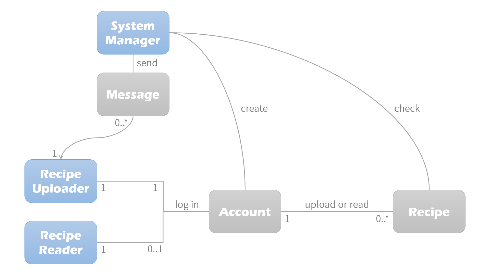

>_**ON&OFF**_  
>_1515023 YeBin Moon_  
>_1615003 Dawn Kim_  
>_1733004 RoYoung Kim_  

## Problem Statement

When people want to cook, they search for a recipe.  
However, usually people have hard time finding recipes that fit their situation.  
For example, there are some situations when someone has no main ingredient or cooking tool.  
The other situation is not enough time to cook.  
 
Recommending different recipes for each user  
depending on the availability of ingredients or cooking tool, and cooking time user wants.  
 

## Analysis

### User Analysis

- **User Class**
  - Recipe Uploader: Who tries to share the recipe  
  - Recipe Reader: Who tries to see the recipe  
  - System Manager: Who manage the system  

- **Characteristic**  
  - [View more](./characteristic.md)  

### Task Analysis

- **Uploader’s point of view**
  - Goal
    - Uploading a recipe
  - Preconditions
    - Must know: how to upload my recipe on the website, how to explain my recipe
  - Subtasks
    - Cook for the recipe I want to upload
    - Take pictures while cooking
    - Log in to the website
    - Write a post for my recipe including what ingredients were needed,  
      what kind of kitchen tools were used and how long the cooking took
    - Divide ingredients by whether they are necessary or optional while cooking

- **Reader’s point of view**
  - Goal
    - Finding a recipe right for me
  - Preconditions
    - Must know: what ingredients and kitchen tools I have, my preference of the cooking time
  - Subtasks
    - Log in to the website
    - Search reflecting your cooking conditions
    - Choose the recipe above all the recipes shown based on the search
    - Click the recipe chosen

- **System Manager’s point of view**
  - Goal
    - Editing the website
  - Preconditions
    - Must know: how to manage the website, contact information of all users
  - Subtasks
    - Look through to find if there is any recipe without cooking condition selected
    - Contact the uploader to edit the recipe
    - Check out system errors

### Domain Analysis

