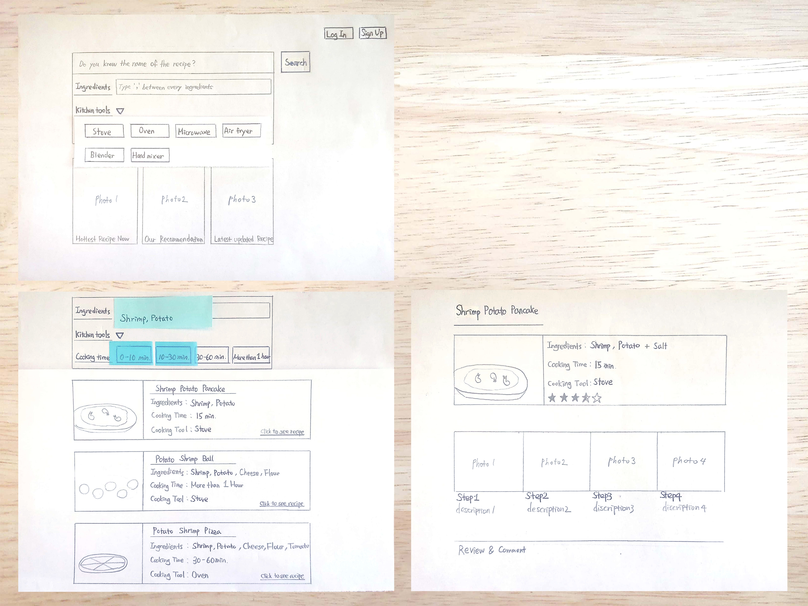
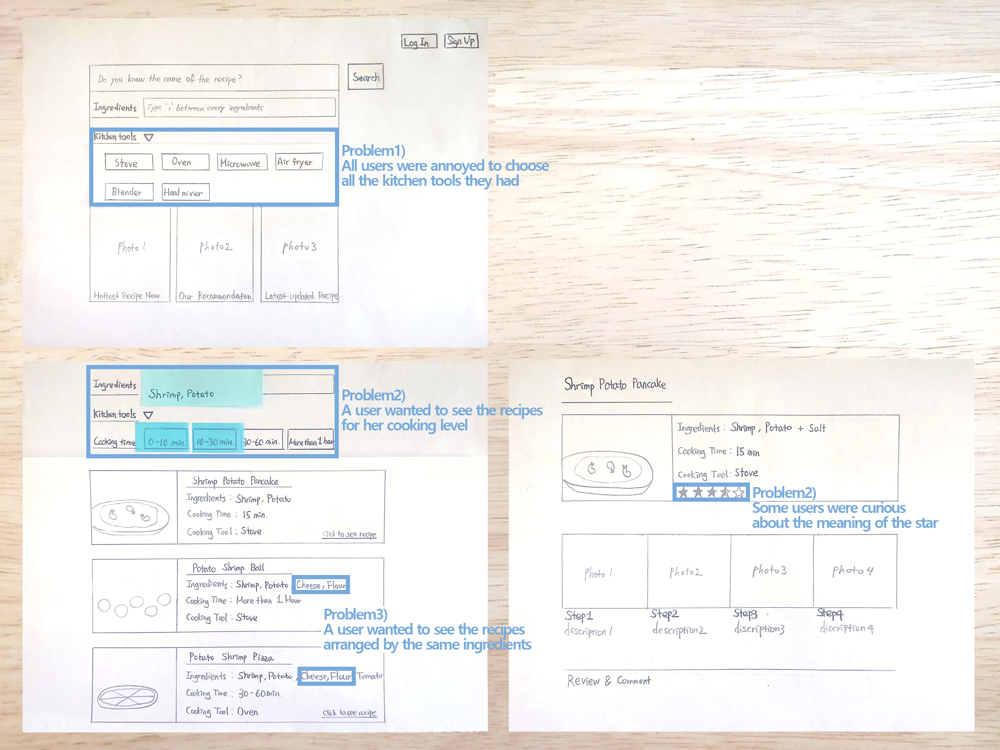
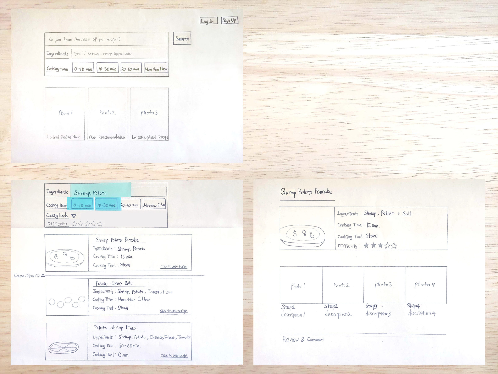

## Paper Prototype

### Before User-Test

### Problems from the Testing

###After User-Test

- The search box has been changed more simply **(Problem1)**

- The word 'kitchen tool' was unified into 'cooking tool'

- If it's hard to find a recipe suitable for user in search results,  
  the user can choose cooking tools or difficulty **(Problem2)**
  
- In addition to searched ingredients the user want to use,  
  users can click the category sorted by ingredients and see recipes **(Problem3)**

- The meaning of the star was changed from popularity to difficulty  
  according to users' preference during the user-test **(Problem4)**

[← Back](./)
